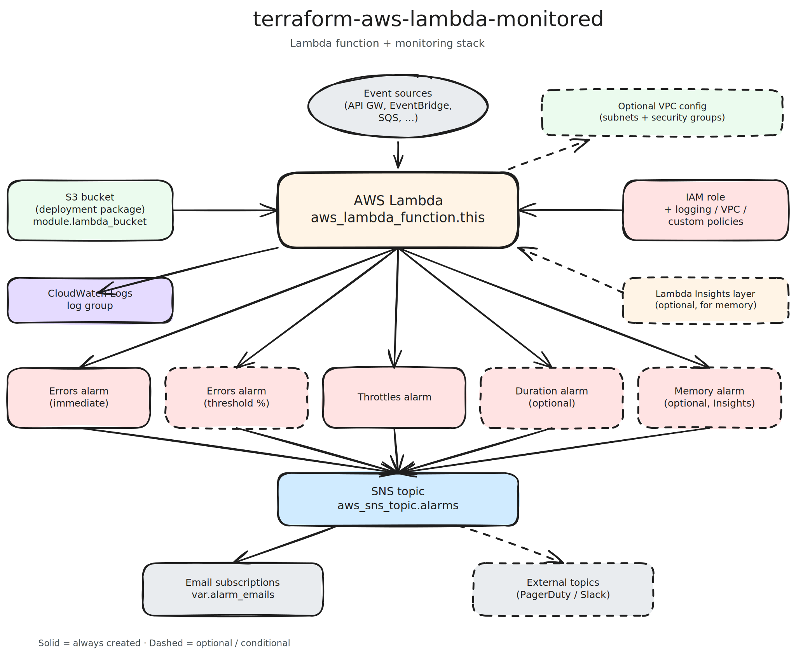

# terraform-aws-lambda-monitored

Terraform module for deploying AWS Lambda functions with built-in CloudWatch monitoring, log retention, and
least-privilege IAM role — compliant with ISO 27001 and Vanta "Serverless function error rate monitored"
requirements.



## Why This Module?

Most Lambda Terraform modules ship a function and stop there, leaving you to bolt on logging, alarms, and an
incident channel yourself. This module treats Lambda as a **production workload from day one** and wires up
the full monitoring stack so you can pass a compliance audit without follow-up work.

- **Monitoring is not optional.** Every function comes with CloudWatch Logs (encrypted, with retention), plus
  alarms for errors, throttles, and execution duration.
- **Two alert strategies.** Pick `immediate` (fire on any error) for low-traffic or critical paths, or
  `threshold` (error-rate metric math) for high-volume functions that expect occasional failures.
- **Alerts go somewhere useful.** SNS topic with email subscriptions is created for you; fan out to existing
  PagerDuty or Slack topics via `alarm_topic_arns`.
- **Reproducible packaging.** Dependencies are installed with `--platform manylinux2014_{x86_64,aarch64}` so
  your local machine's architecture and Python version don't leak into the deployment artifact.
- **Smart change detection.** Only source files plus `requirements.txt` hash into the deployment — recreating
  `.terraform` doesn't trigger spurious re-uploads.
- **Tight IAM by default.** Logging policy is scoped to the function's log group; VPC access (when enabled)
  grants ENI permissions only to the subnets you specified.

## Features

- Multi-architecture packaging (x86_64, arm64) with platform-specific dependency wheels
- Multi-Python version support (3.9 through 3.13)
- CloudWatch Logs with configurable retention and optional KMS encryption
- CloudWatch alarms: errors (immediate or rate-based), throttles, duration, optional memory
- SNS topic + email subscriptions for alert delivery
- Fan-out to additional SNS topics (PagerDuty, Slack, etc.)
- Optional VPC configuration with tightly-scoped ENI permissions
- Optional Lambda Insights layer for memory-utilization metrics
- Pluggable IAM — attach any additional policy via `additional_iam_policy_arns`
- Integration tests against real AWS infrastructure

## Quick Start

```hcl
module "lambda" {
  source  = "registry.infrahouse.com/infrahouse/lambda-monitored/aws"
  version = "1.1.0"

  function_name     = "my-lambda-function"
  lambda_source_dir = "${path.module}/lambda"

  alarm_emails = ["oncall@example.com"]
}
```

Head over to [Getting Started](getting-started.md) for prerequisites and a full walkthrough, or skip to the
[Configuration](configuration.md) reference for every available variable.

## Where to next

- [Getting Started](getting-started.md) — prerequisites, first deployment, tests
- [Architecture](architecture.md) — how the module is put together
- [Configuration](configuration.md) — all variables explained with examples
- [Examples](examples.md) — common use cases
- [Troubleshooting](troubleshooting.md) — what to check when something goes wrong
